# Web Version of LabPlanner

The goal of this project was to create a graphical interface that facilitates the authoring of LabSheets. To do this, I used HTML, CSS, and Javascript to create a website which has five different pages, each of which guides the user through creating a specific type of LabSheet (PCR, Gel, Zymo, Assembly, or Transform). Each page has a series of labeled text boxes which allow the user to input relevant information; at the end, there is a "Generate Labsheet" button which outputs the entered information in the standard LabSheet format. This generated output can them be copied and pasted into Word.

## PCR

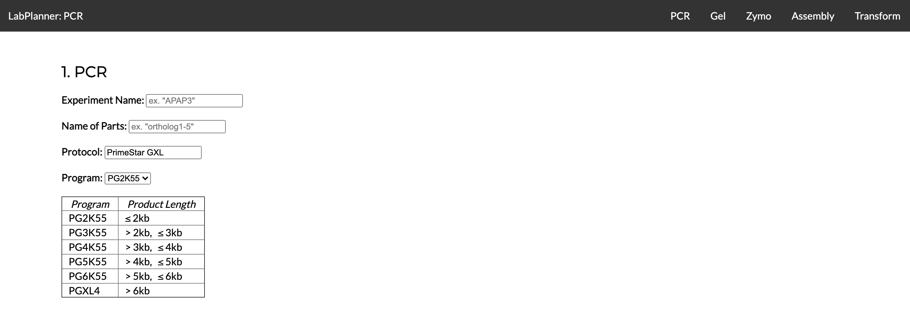

Users can navigate between different pages using the navigation bar at the top, and they can identify which page they are on by the label in the top left hand corner.

For the PCR step, users are asked to input their experiment name as well as the name of the parts that correspond to this particular LabSheet. This will show up in the final generated LabSheet as "Experiment Name/Part Name." For example, for the experiment APAP3 and the LabSheet for running PCR on the backbone, we would enter "APAP3" under Experiment Name and "back" under Name of Parts, which results in the heading "APAP3/back."

Users can also pick a polymerase protocl and corresponding thermocycler program. The default is PrimeStar, although this text can be changed. There is a dropdown of programs to choose from, and a chart right below it to help users identify which program is most appropriate for their experiment.

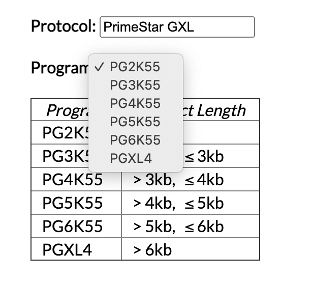

Below the protocol and program selection we have our source information. Each text box can be filled in with the relevant information, and users can press the black "+" button to add additional rows as needed.

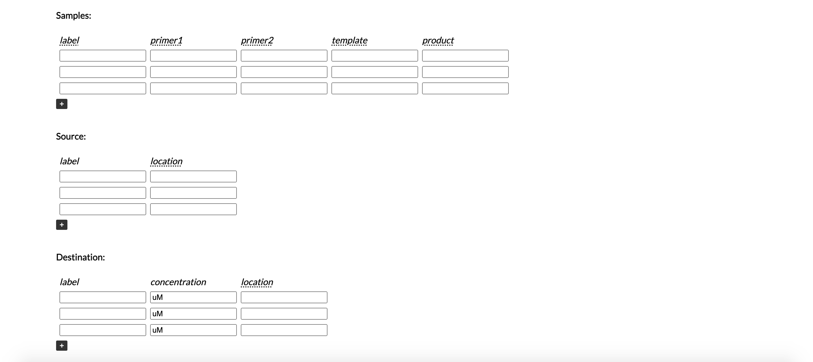

Additionally, any text with a dotted black underline has an accompanying tool tip. That is, if the user hovers over the text, they will see additional details that can help them figure out what information should go in the blanks.

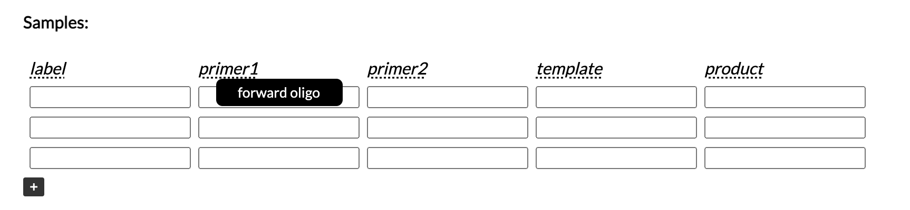

 A completed input might look something like this (this screenshot is zoomed out to see the entire screen):

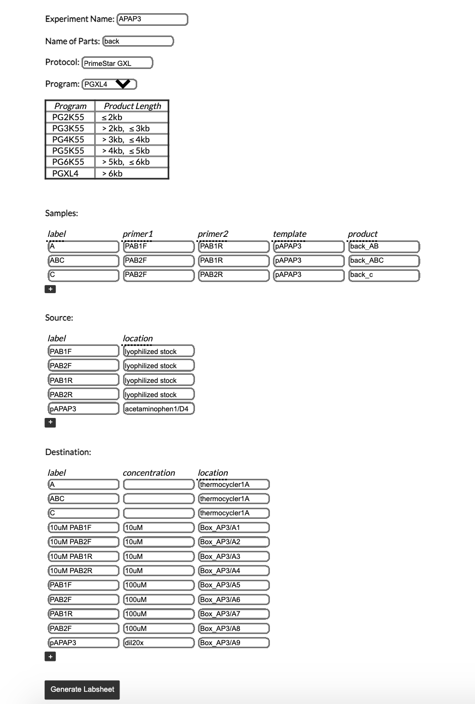

Once the user hits the "Generate Labsheet" button, something like this will generate at the bottom of the page:

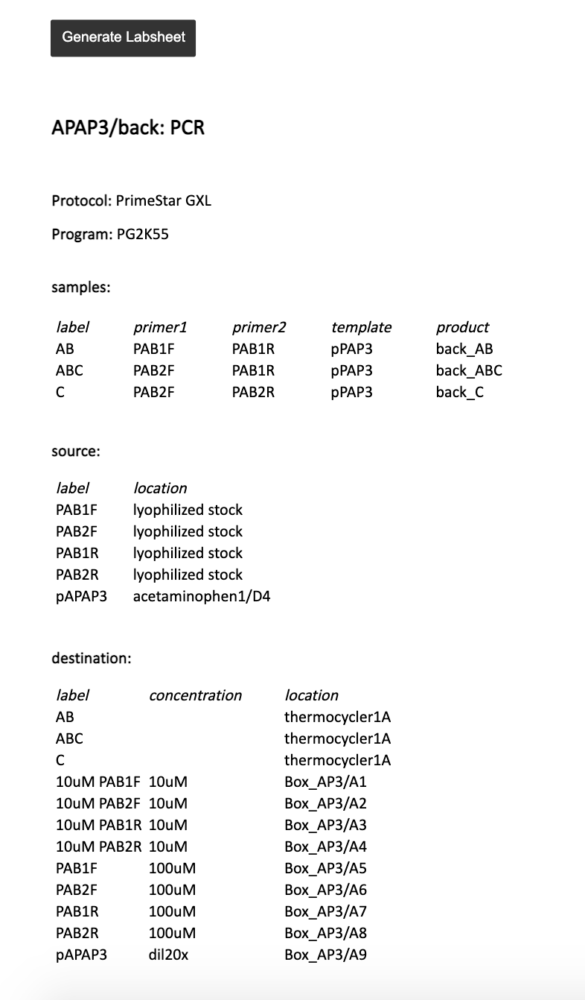

This text can directly be copied and pasted into Word, although there are some formatting issues that are a work in progress:

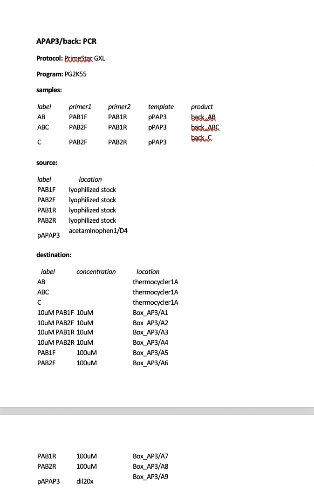

## Zymo and Gel

The structure for the Zymo and Gel pages are quite straightforward and follows the mechanism of the PCR page exactly. The input text boxes, "Generate LabSheet" button, and tool tips are all in place:

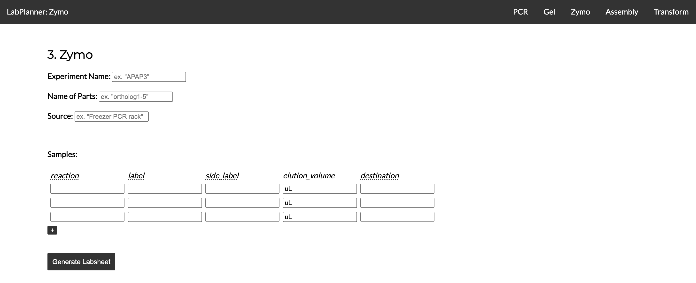
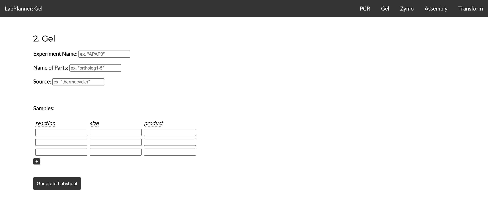

## Assembly

For the most part, the Assembly page is identical to the previous three, with an additional input text box for users to specify the restriction enzyme being used:

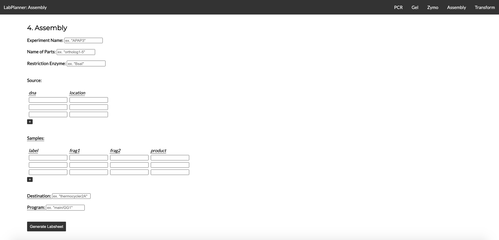

However, it is worth noting that this is usually the LabSheet in which volume calculations for the master mix need to take place. The website will automatically do this for the users, based on how many entries are entered into the "sample" section. The backend program will calculated the number of entries, add 0.5, and multiply the the constancts provided in the "Labsheet planner" spreadsheet. For example, for the following input with 6 entries:

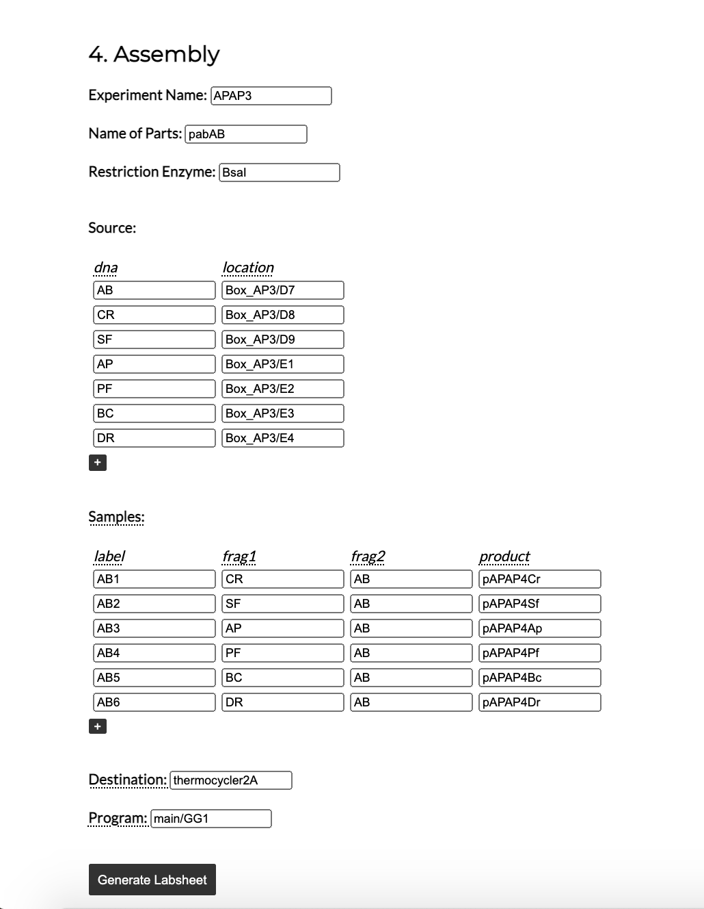

We get the following output:

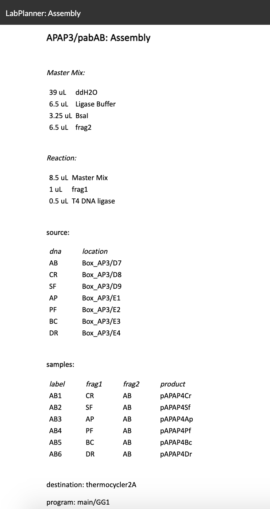

where we have 6.5 * 6 uL of ddH2O, 6.5 * 1 uL of ligase buffer, 6.5 * 0.5 uL of the restriction enzyme, and 6.5 * 1 uL of DNA.

## Transform

Once again, the Transform page is very similar to the other pages; however, there are two new checkboxes:

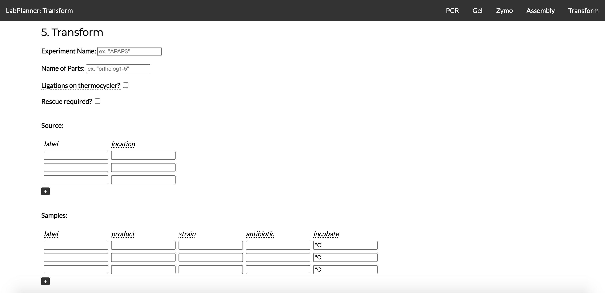

The first checkbox is for the user to mark whether or not the products from the assembly step are coming from the thermocycler. If they are, there is no need to fill out the text boxes individually for each product; instead, this information will be denoted at the top of the "source" section.

The second checkbox allows the user to mark if rescue is required. This will determine whether the "rescue_required:" text at the bottom of the sheet is followed by "yes" or "no."

For example, with the following input:

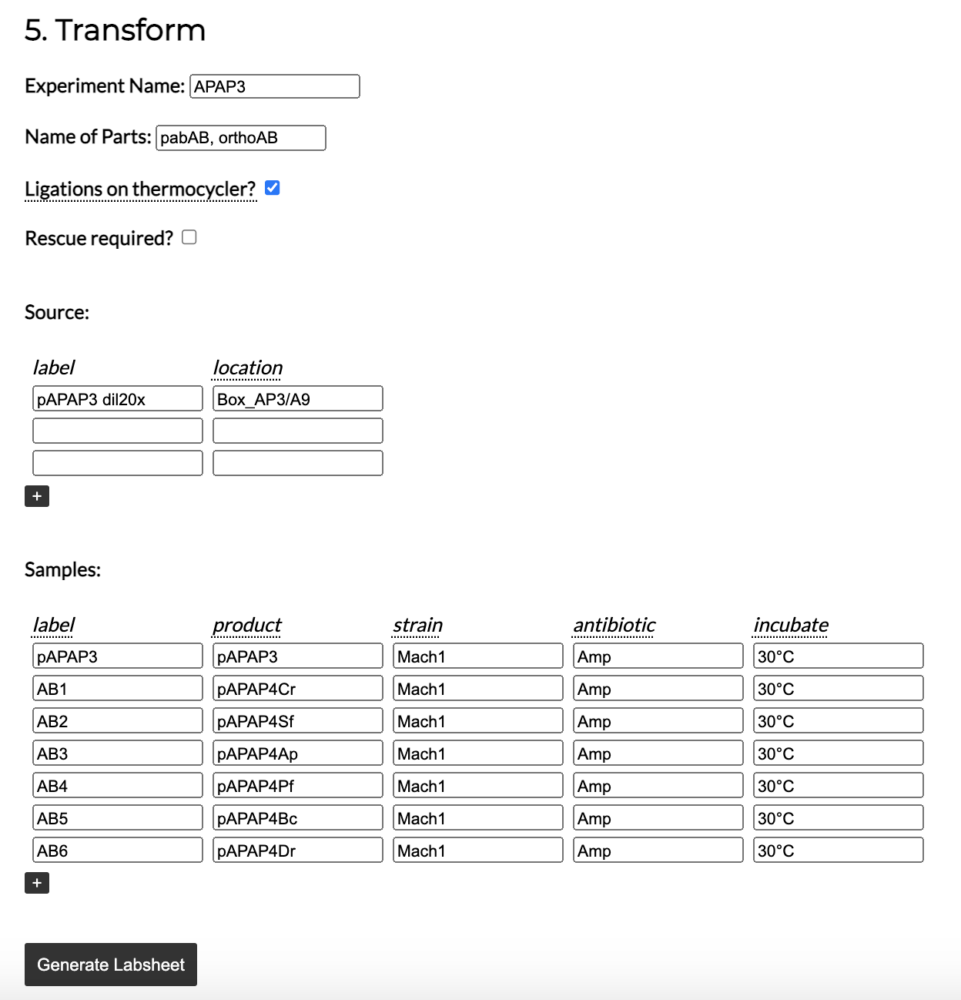

we have the following output:

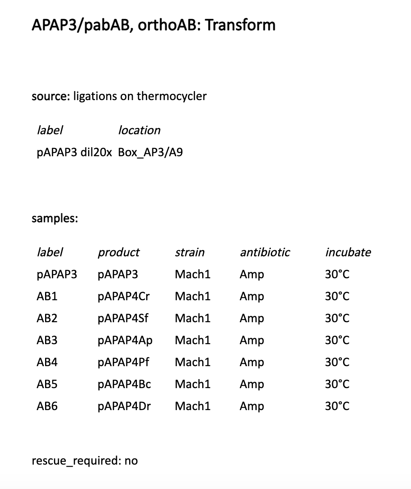

Notice the "ligations on thermocycler" next to "source:" and the "rescue_required: no" at the bottom.

## Files and Structure

Each page has its own HTML and Javascript file; however, they all share one CSS file. With the exception of PCR, each one is named [step].html and [step_scripts].js. The HTML file for PCR is called "index.html" because this is the way GitHub Pages identifies the which page to host. The functions for adding additional text input boxes and for generating the final LabSheets are all contained in the corresponding Javascript files. The functions in pcr_scripts.js are commented; the rest are not, as they all follow similar structures.

